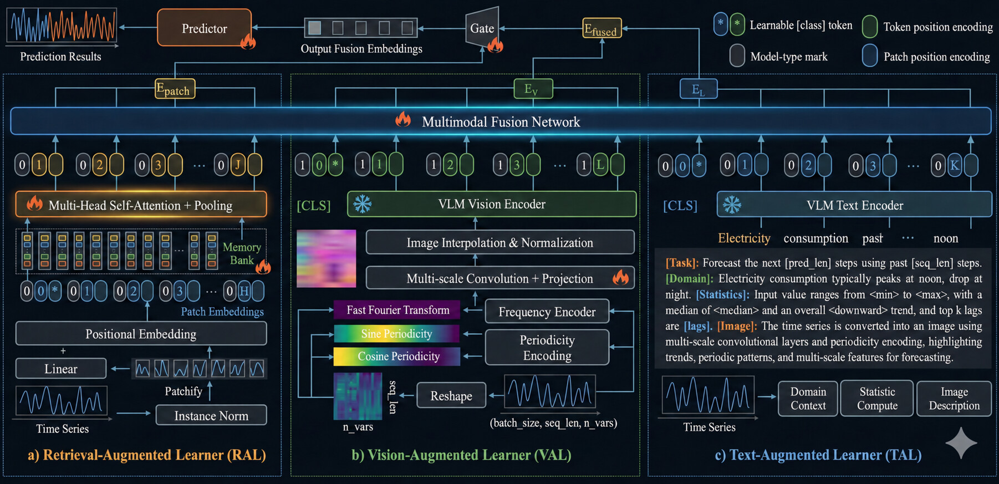

# Multimodal Time-Series Forecasting

[](https://github.com/jingsiihu-ai/multimodal-timeseries/actions/workflows/tests.yml)
[](https://www.python.org/)
[](LICENSE)

A compact, reproducible reference implementation for forecasting numerical sequences with short natural-language context.

The repository demonstrates the central engineering ideas behind my multimodal time-series work: patch-based temporal encoding, text-conditioned fusion, parameter-efficient adaptation, and contrastive alignment. It is a clean-room public implementation built around synthetic data so that every example can be run without private datasets.

## What is included

- `SeriesPatchEncoder` for mapping fixed-length temporal patches into latent tokens;
- `TextContextEncoder` for encoding short metadata descriptions;
- gated multimodal fusion and multi-step forecasting;
- a reusable `LoRALinear` layer for parameter-efficient adaptation;
- symmetric InfoNCE alignment between time-series and text representations;
- deterministic synthetic data, unit tests, and a CPU-friendly training demo.

## Architecture

<p align="center">
  
</p>

## Quick start

```bash
python -m venv .venv
source .venv/bin/activate
pip install -e .
python examples/synthetic_demo.py
pytest
```

The demo creates seasonal signals with context such as `high demand` or `low demand`, trains on CPU, and prints the validation error before and after optimization.

## Scope and reproducibility

This release illustrates the method and software interfaces; it does **not** claim to reproduce metrics from private or earlier research datasets. Any benchmark number should be generated from a versioned configuration and attached artifact before it is cited.

The implementation is informed by public research on language-model adaptation for time series, prompt tuning, and LoRA, but all code here was written independently. See [docs/method.md](docs/method.md) for design notes and references.

